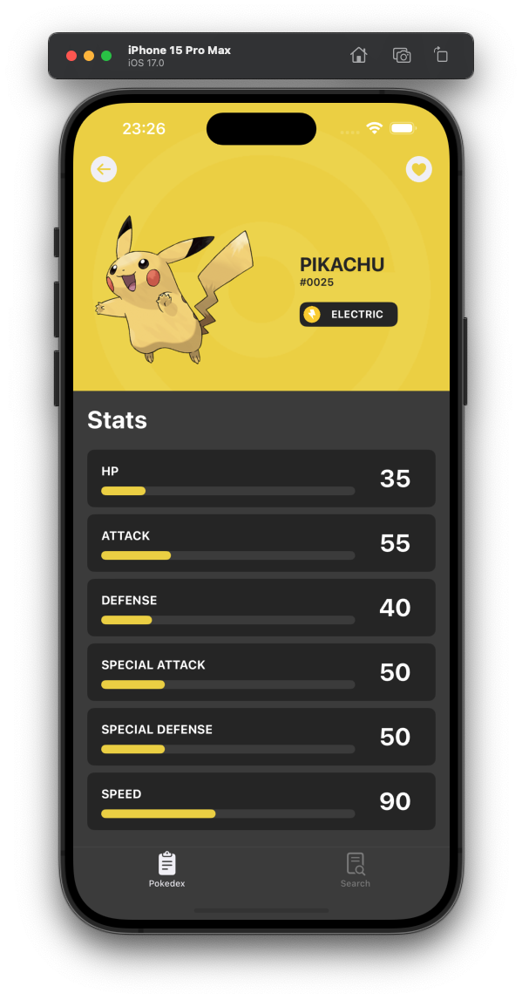
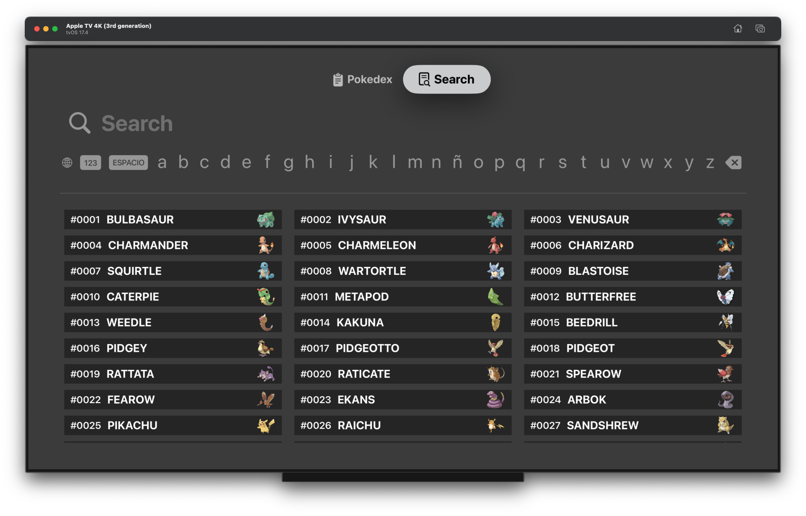

# Pokédex
Pokédex is an iOS application that interacts with the Pokemon API.

# iPhone

  
  
  
  
  
  
  
  

# iPad

  
  
  
  
  
  
  
  

# AppleTV

  
  
  
  
  
  
  
  

# Features
- Pokédex
- Pokémon detail
- Favorite Pokémon list
- Search Pokémon

# Additional features
- Light and dark mode
- iPhone, iPad and tvOS

# Architecture
- TCA (The Composable Architecture)

# Code
- Swift
- SwiftUI

# Local libraries
- DesignSystem (theme, color, spacing, font and reusable components and styles)
- API (network request using URLSession)

# 3rd party libraries
- TCA (The Composable Architecture)
- Kingfisher (Images cache)

# Unit testing
- TCA (The Composable Architecture)

# UI testing
- SnapshotTesting

# Requirements
- iOS 17.0+
- Swift 5.0+

# License
Copyright 2024 Jordi Gámez
